# Vehicle Detection
### Udacity Self-Driving Car Nanodegree - Project 5 
[](http://www.udacity.com/drive)

---

The goals / steps of this project are the following:

* Perform a Histogram of Oriented Gradients (HOG) feature extraction on a labeled training set of images and train a classifier Linear SVM classifier
* Optionally, you can also apply a color transform and append binned color features, as well as histograms of color, to your HOG feature vector. 
* Note: for those first two steps don't forget to normalize your features and randomize a selection for training and testing.
* Implement a sliding-window technique and use your trained classifier to search for vehicles in images.
* Run your pipeline on a video stream (start with the test_video.mp4 and later implement on full project_video.mp4) and create a heat map of recurring detections frame by frame to reject outliers and follow detected vehicles.
* Estimate a bounding box for vehicles detected.

### Here I will consider the rubric points individually.  

---

## Histogram of Oriented Gradients (HOG)

#### 1. Explain how (and identify where in your code) you extracted HOG features from the training images.

The code for getting the HOG features was taken directly from the course work.

````
# Define a function to return HOG features and visualization
# Vis == False means we do not want to get an image back, True produces output image.
def get_hog_features(img, 
                     orient, 
                     pix_per_cell, 
                     cell_per_block, 
                     vis=False, 
                     feature_vec=True):
    if vis == True:
        features, hog_image = hog(img, 
                                  orientations=orient, 
                                  pixels_per_cell=(pix_per_cell, pix_per_cell),
                                  cells_per_block=(cell_per_block, cell_per_block), 
                                  transform_sqrt=False, 
                                  visualise=vis, 
                                  feature_vector=feature_vec)
        return features, hog_image
    else:      
        features = hog(img, 
                       orientations=orient, 
                       pixels_per_cell=(pix_per_cell, pix_per_cell),
                       cells_per_block=(cell_per_block, cell_per_block), 
                       transform_sqrt=False, 
                       visualise=vis, 
                       feature_vector=feature_vec)
        return features

````

I visualize the rerturn on the HOG images after cell 5.

````
# Choose random images from the images of cars and non cars read in
car_ind = np.random.randint(0, len(cars))
notcar_ind = np.random.randint(0, len(notcars))

# Read in a car and non car image
car_image = mpimg.imread(cars[car_ind])
notcar_image = mpimg.imread(notcars[notcar_ind])

color_space = 'RGB'
orient = 9
pix_per_cell = 8
cell_per_block = 2
hog_channel = 0
spatial_size = (16,16)
hist_bins = 16
spatial_feat = True
hist_feat = True
hog_feat = True

car_features, car_hog_image = single_img_features(car_image,
                                                  color_space = color_space,
                                                  spatial_size = spatial_size,
                                                  hist_bins = hist_bins,
                                                  orient = orient,
                                                  pix_per_cell = pix_per_cell,
                                                  cell_per_block = cell_per_block,
                                                  hog_channel = hog_channel,
                                                  spatial_feat = spatial_feat,
                                                  hist_feat = hist_feat,
                                                  hog_feat = hog_feat,
                                                  vis = True
                                                 )

notcar_features, notcar_hog_image = single_img_features(notcar_image,
                                                  color_space = color_space,
                                                  spatial_size = spatial_size,
                                                  hist_bins = hist_bins,
                                                  orient = orient,
                                                  pix_per_cell = pix_per_cell,
                                                  cell_per_block = cell_per_block,
                                                  hog_channel = hog_channel,
                                                  spatial_feat = spatial_feat,
                                                  hist_feat = hist_feat,
                                                  hog_feat = hog_feat,
                                                  vis = True
                                                 )
images = [car_image, car_hog_image, notcar_image, notcar_hog_image]
titles = ['car image '+str(car_image.shape)+'', 'car HOG image', 'Notcar image '+str(notcar_image.shape)+'', 'not car HOG image']
fig = plt.figure(figsize=(12,3)) 
visualize(fig, 1, 4, images, titles)
````

The return looks like the images below.

<p align="center">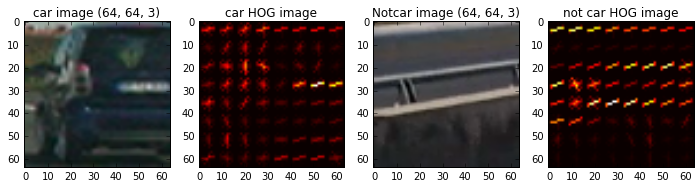</p>

I then explored different color spaces on random images from each of the two classes and displayed them to get a feel for what the `skimage.hog()` output looks like. The other settings are all the same, based off of coursework and walk through video.

````
color_space = ''
orient = 9
pix_per_cell = 8
cell_per_block = 2
hog_channel = 0
spatial_size = (16,16)
hist_bins = 16
spatial_feat = True
hist_feat = True
hog_feat = True

````

*  YCrCb (What I used for the project, should be same as above).

<p align="center">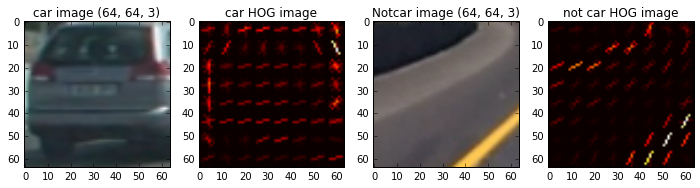</p>

* RGB

<p align="center">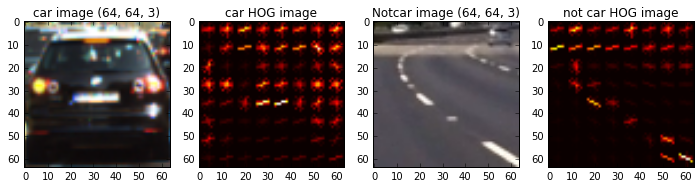</p>

* HSV

<p align="center">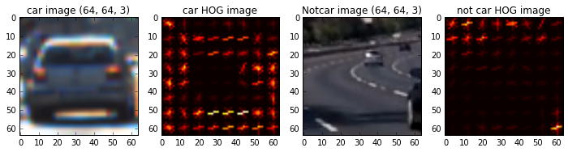</p>

* LUV

<p align="center">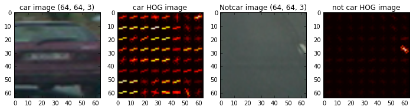</p>

* HLS

<p align="center">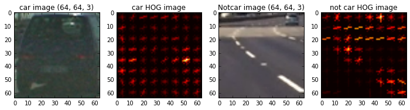</p>


#### 2. Explain how you settled on your final choice of HOG parameters.

Based on the images created above I did not feel like it was obivous that one would be better than another.  I decided to wait to run the classifier and see if one produced clearly better results.

#### 3. Describe how (and identify where in your code) you trained a classifier using your selected HOG features (and color features if you used them).

The classifier code is located in cell 10 and, again, was taken from the course work and the walk through video.

````

# Define feature parameters
color_space = 'YCrCb'
orient = 9
pix_per_cell = 8
cell_per_block = 2
hog_channel = 'ALL'
spatial_size = (16, 16)
hist_bins = 16
spatial_feat = True
hist_feat = True
hog_feat = True

t = time.time()
n_samples = 2000
# Generate 1000 random indices
random_idxs = np.random.randint(0 , len(cars), n_samples)
test_cars = np.array(cars)[random_idxs]
test_notcars = np.array(notcars)[random_idxs]

car_features = extract_features(test_cars,
                               color_space = color_space,
                               spatial_size = spatial_size,
                               hist_bins = hist_bins,
                               orient = orient,
                               pix_per_cell = pix_per_cell,
                               cell_per_block = cell_per_block,
                               hog_channel = hog_channel,
                               spatial_feat = spatial_feat,
                               hist_feat = hist_feat,
                               hog_feat = hog_feat
                               )

notcar_features = extract_features(test_notcars,
                               color_space = color_space,
                               spatial_size = spatial_size,
                               hist_bins = hist_bins,
                               orient = orient,
                               pix_per_cell = pix_per_cell,
                               cell_per_block = cell_per_block,
                               hog_channel = hog_channel,
                               spatial_feat = spatial_feat,
                               hist_feat = hist_feat,
                               hog_feat = hog_feat
                               )

print(time.time()-t, 'Seconds to compute features...')

X = np.vstack((car_features, notcar_features)).astype(np.float64)
X_scaler = StandardScaler().fit(X)
scaled_X = X_scaler.transform(X)

y = np.hstack((np.ones(len(car_features)), np.zeros(len(notcar_features))))

rand_state = np.random.randint(0, 100)
X_train, X_test, y_train, y_test = train_test_split(scaled_X,
                                                   y,
                                                   test_size = 0.1,
                                                   random_state = rand_state
                                                   )
print('Using : ', orient,' orientations, ',pix_per_cell,'pixels per cell ', cell_per_block,'...etc...')
print('Feature vector length : ', len(X_train[0]))

# Use SVC
svc = LinearSVC()

t = time.time()
svc.fit(X_train, y_train)
print(round(time.time() -t, 2 ), "Seconds to train SVC...")

print('Test accuracy of SVC = ', round(svc.score(X_test, y_test), 4))

````

*  YCrCB results

<p align="center">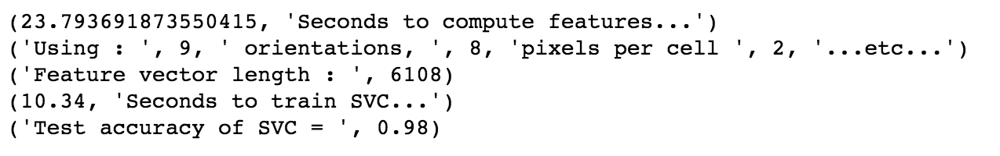</p>

* RGB result

<p align="center">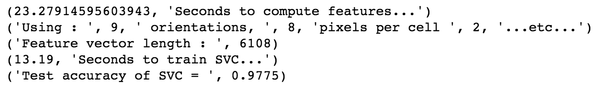</p>

* HSV results

<p align="center">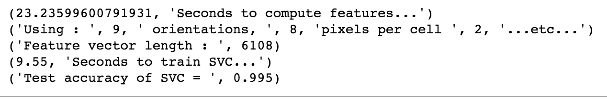</p>

* LUV results

<p align="center">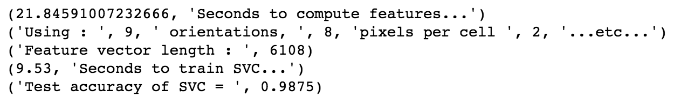</p>

* HLS results

<p align="center">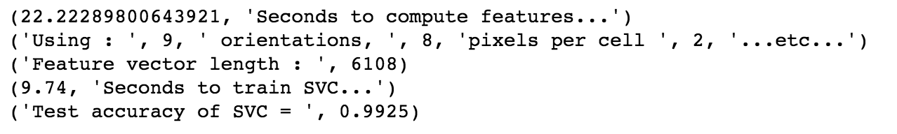</p>

The results overall where not terribly different, but LUV and RGB where the lowest.

### Sliding Window Search

#### 1. Describe how (and identify where in your code) you implemented a sliding window search.  How did you decide what scales to search and how much to overlap windows?

This code was taken directly from the coursework and from the wlk through video.


````
out_images = []
out_maps = []
out_titles = []
out_boxes = []
ystart = 400
ystop = 656
# Scale entire image and subsample the array
scale = 1.8

for img_src in example_images:
    img_boxes = []
    t = time.time()
    count = 0
    img = mpimg.imread(img_src)
    draw_img = np.copy(img)
    
    # Make a heat map
    heatmap = np.zeros_like(img[:,:,0])
    img = img.astype(np.float32) / 255
    
    img_tosearch = img[ystart:ystop,:,:]
    ctrans_tosearch = convert_color(img_tosearch, conv='RGB2YCrCb')
    
    if scale != 1:
        imshape = ctrans_tosearch.shape
        ctrans_tosearch = cv2.resize(ctrans_tosearch, (np.int(imshape[1]/scale), np.int(imshape[0]/scale)))
        
    ch1 = ctrans_tosearch[:,:,0]
    ch2 = ctrans_tosearch[:,:,1]
    ch3 = ctrans_tosearch[:,:,2]
   
    # Use // to remove floating points from results
    nxblocks = (ch1.shape[1] // pix_per_cell) - 1
    nyblocks = (ch1.shape[0] // pix_per_cell) - 1
    
    nfeat_per_block = orient * cell_per_block**2
    window = 64
    nblocks_per_window = (window // pix_per_cell) - 1
    cells_per_step = 2
    nxsteps = (nxblocks - nblocks_per_window) // cells_per_step
    nysteps = (nyblocks - nblocks_per_window) // cells_per_step
    
    # Compute individual channel HOG features for the entire image
    hog1 = get_hog_features(ch1, orient, pix_per_cell, cell_per_block, feature_vec=False)
    hog2 = get_hog_features(ch2, orient, pix_per_cell, cell_per_block, feature_vec=False)
    hog3 = get_hog_features(ch3, orient, pix_per_cell, cell_per_block, feature_vec=False)
    
    for xb in range(nxsteps):
        for yb in range(nysteps):
            count += 1
            ypos = yb * cells_per_step
            xpos = xb * cells_per_step
            
            hog_feat1 = hog1[ypos:ypos + nblocks_per_window, xpos:xpos + nblocks_per_window].ravel()
            hog_feat2 = hog2[ypos:ypos + nblocks_per_window, xpos:xpos + nblocks_per_window].ravel()
            hog_feat3 = hog3[ypos:ypos + nblocks_per_window, xpos:xpos + nblocks_per_window].ravel()
            hog_features = np.hstack((hog_feat1, hog_feat2, hog_feat3))
            
            xleft = xpos * pix_per_cell
            ytop = ypos * pix_per_cell
            
            # Extract the image patch   
            subimg = cv2.resize(ctrans_tosearch[ytop:ytop + window, xleft:xleft + window], (64,64))
          
            # Get color features
            spatial_features = bin_spatial(subimg, size=spatial_size)
            hist_features = color_hist(subimg, nbins=hist_bins)
            
            # Scale features and make a prediction
            test_features = X_scaler.transform(np.hstack((spatial_features, hist_features, hog_features)).reshape(1, -1))    
   
            test_prediction = svc.predict(test_features)
            
            if test_prediction == 1:
                xbox_left = np.int(xleft * scale)
                ytop_draw = np.int(ytop * scale)
                win_draw = np.int(window * scale)
                cv2.rectangle(draw_img,(xbox_left, ytop_draw + ystart),(xbox_left + win_draw, ytop_draw + win_draw + ystart),(0,0,255),6)
                img_boxes.append(((xbox_left, ytop_draw +  ystart),(xbox_left + win_draw, ytop_draw + win_draw + ystart)))
                heatmap[ytop_draw + ystart:ytop_draw + win_draw + ystart, xbox_left:xbox_left + win_draw] +=1
                
    print(time.time() - t, 'seconds to run, total windows = ', count)
    
    out_images.append(draw_img)
    
    out_titles.append(img_src[-12:])
    out_titles.append(img_src[-12:])
    
    out_images.append(heatmap)
    out_maps.append(heatmap)
    out_boxes.append(img_boxes)

fig = plt.figure(figsize = (12,24))
visualize(fig, 8, 2, out_images, out_titles)  

````

#### 2. Show some examples of test images to demonstrate how your pipeline is working.  What did you do to optimize the performance of your classifier?

Here is where YCrCb became my choice because it produced the best results. Here are some example images run through the pipeline:

<p align="center">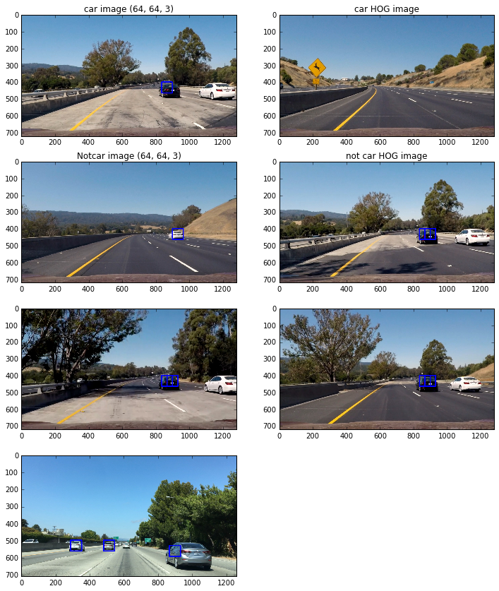</p>

HLS, for example, had more false positives with the same settings

<p align="center"></p>

---

### Video Implementation

#### 1. Provide a link to your final video output.  Your pipeline should perform reasonably well on the entire project video (somewhat wobbly or unstable bounding boxes are ok as long as you are identifying the vehicles most of the time with minimal false positives.)

Here's a [link to my video result](./project_video.mp4)


#### 2. Describe how (and identify where in your code) you implemented some kind of filter for false positives and some method for combining overlapping bounding boxes.

I recorded the positions of positive detections in each frame of the video.  From the positive detections I created a heatmap and then thresholded that map to identify vehicle positions.  I then used `scipy.ndimage.measurements.label()` to identify individual blobs in the heatmap.  I then assumed each blob corresponded to a vehicle.  I constructed bounding boxes to cover the area of each blob detected.  

Here's an example result showing the heatmap from a series of frames of video, the result of `scipy.ndimage.measurements.label()` and the bounding boxes then overlaid on the last frame of video:

##### Here are six frames and their corresponding heatmaps:

<p align="center">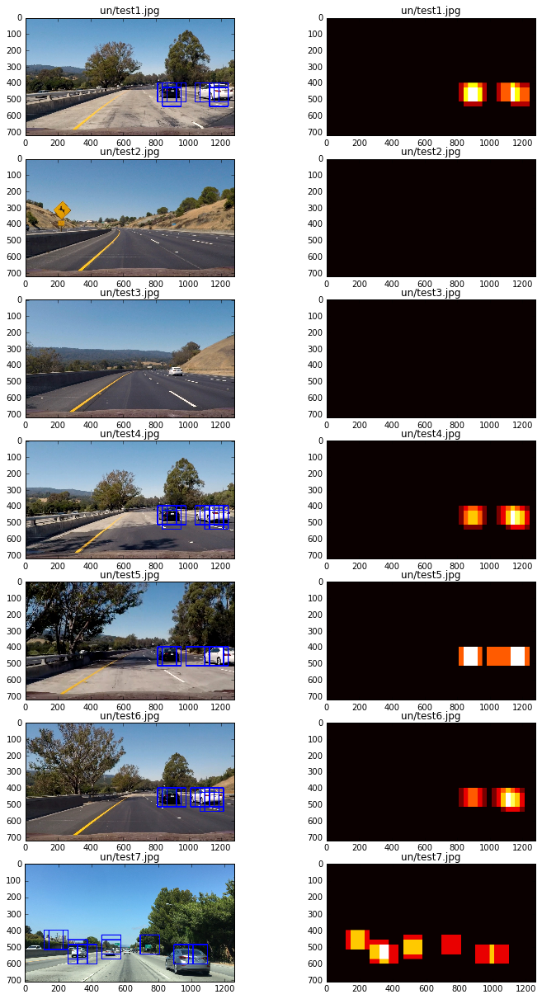</p>

##### Here is the code using `scipy.ndimage.measurements.label()` on the images being processed:

````
def process_image(img):
    out_img, heat_map = find_cars(img, scale)
    labels = label(heat_map)
    draw_img = draw_labeled_bboxes(np.copy(img), labels)
    return draw_img

````

---

### Discussion

#### 1. Briefly discuss any problems / issues you faced in your implementation of this project.  Where will your pipeline likely fail?  What could you do to make it more robust?

I have yet to try it out on a busy street.  I also feel it would fail if there was a lot of movement, like in windy conditions, where things move across the rod.  Although, that is just a guess, nothing tested yet. I am also unsure how well it would do in less than ideal driving conditions such as rain, snow, night-time driving. etc.

Overall I feel this is a good start but to make something like this truly useful It would need a lot of testing in different conditions.

Improvements
  * Need to adjust scale so I can detect images further away in the image.
  * Need to do a better job smoothing out the boxes in order to eliminate flashing boxes.
